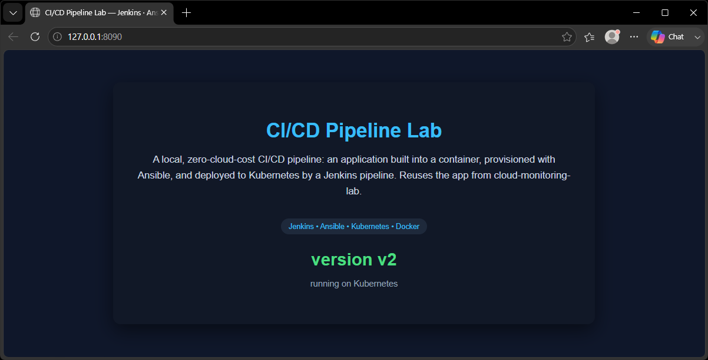
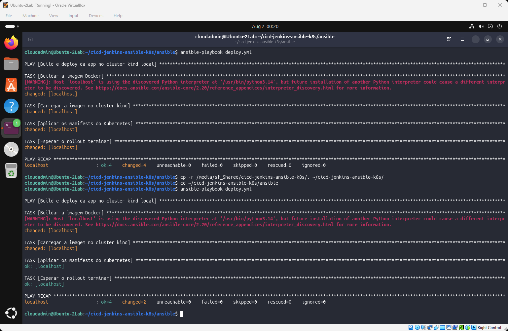
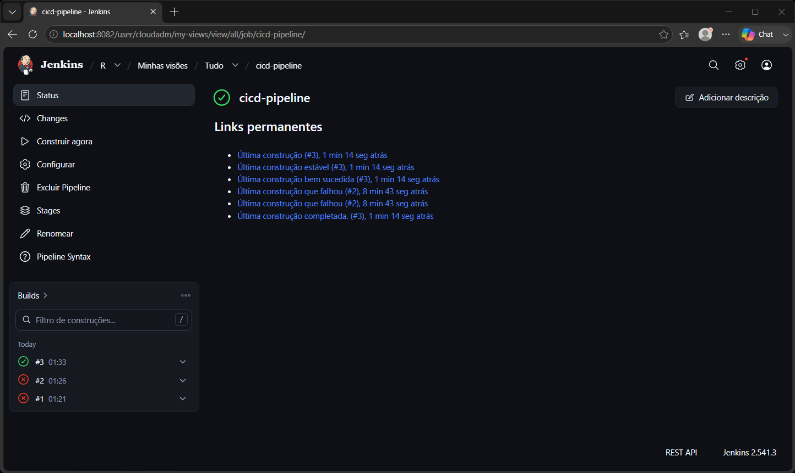

# CI/CD Pipeline with Jenkins, Ansible & Kubernetes

A local, **zero-cloud-cost** CI/CD lab: a containerized web app deployed to a
**Kubernetes** cluster (kind), provisioned by **Ansible**, and driven by a
**Jenkins** pipeline — build the image, run the playbook, deploy to the cluster.
Everything runs on a single Linux VM with Docker. Reuses the app and the
Prometheus/Grafana stack from
[cloud-monitoring-lab](https://github.com/rcarra-arq/cloud-monitoring-lab).

> **Portfolio focus:** the missing pieces of a DevOps toolkit — **config
> management (Ansible)**, **self-hosted CI/CD (Jenkins)** and **container
> orchestration (Kubernetes)** — built hands-on, with **documented,
> real-world troubleshooting write-ups**.

*Versão em português abaixo.* 🇧🇷

---

## Status / roadmap

This is a lab built in stages. Honest status:

| Stage | What | Status |
|---|---|---|
| 1 | **Kubernetes** — kind cluster, Deployment, Service, self-healing | ✅ done |
| 2 | **App on the cluster** — custom image, `kind load`, rolling update | ✅ done |
| 3 | **Ansible** — playbook that builds, loads and applies the manifests | ✅ done |
| 4 | **Jenkins** — pipeline: build → load → deploy (via Ansible) | ✅ done |
| 5 | **Monitoring** — Prometheus + Grafana watching the cluster | 🔜 planned |

## Target architecture

```
Developer ──push──▶ GitHub ──▶ GitHub Actions      (fast CI gate)
                               ├─ build image + smoke test (HTTP 200)
                               └─ validate Kubernetes manifests

                    Jenkins (container)             (full CD pipeline)
                    ├─ build the Docker image
                    ├─ load image into kind cluster
                    └─ run Ansible playbook → deploy to Kubernetes

kind cluster (Kubernetes in Docker)
   └── Deployment "web" (2 replicas) ──▶ Service "web" (stable ClusterIP + DNS)
                                             └── nginx pods serving the app
```

GitHub Actions and Jenkins are **complementary**: Actions is the lightweight gate
that runs on every push (does it build? does it answer 200? are the manifests
valid?); Jenkins runs the heavier continuous-delivery pipeline that actually
deploys to Kubernetes.

## Stack

| Component | Role |
|---|---|
| kind (Kubernetes in Docker) | Runs a real Kubernetes cluster as Docker containers — light, fast, zero cloud cost |
| Deployment + ReplicaSet | Keeps N identical pods alive; self-heals and does rolling updates |
| Service (ClusterIP) | Stable virtual IP + DNS name in front of the ephemeral pods |
| Docker | Builds the app image (nginx + custom page) |
| Ansible | Provisions and applies the manifests declaratively |
| Jenkins | Self-hosted CI/CD pipeline — Docker-outside-of-Docker pattern |
| GitHub Actions | Fast CI: build, smoke test, manifest validation |

## Quick start (what works today)

Requires a Linux host with Docker, plus `kubectl` and `kind`.

```bash
# 1. Create the cluster (pinned Kubernetes node image)
kind create cluster --config k8s/kind-config.yaml

# 2. Build the app image and load it INTO the kind cluster
#    (kind clusters can't see your local Docker images — you must load them)
docker build -t web-app:v2 .
kind load docker-image web-app:v2 --name cicd-lab

# 3. Deploy
kubectl apply -f k8s/deployment.yaml
kubectl apply -f k8s/service.yaml
kubectl rollout status deployment/web

# 4. See it (dev/debug tunnel to the Service)
kubectl port-forward service/web 8090:80
#    → open http://localhost:8090
```

Tear down the cluster with `kind delete cluster --name cicd-lab`.



## Ansible — automating the deploy

The four manual steps above (build → `kind load` → `kubectl apply` → rollout) are
automated by a playbook ([ansible/deploy.yml](ansible/deploy.yml)) — one command
replaces four:

```bash
cd ansible && ansible-playbook deploy.yml
```

The playbook also shows **idempotency** in action. With the plain `command`
module every task reports `changed` (it runs blindly). Using `changed_when`, the
**declarative** steps tell the truth: `kubectl apply` reports `changed` only when
the cluster actually changes, and the rollout check never counts as a change. In
the two runs below, the recap drops from `changed=4` to `changed=2`, and the
apply and rollout tasks flip from `changed` to `ok`:



## Jenkins — the CI/CD pipeline

Jenkins runs as a container on the same VM, using the **Docker-outside-of-Docker**
pattern: it mounts the host's Docker socket (`/var/run/docker.sock`) instead of
running its own daemon. A custom image ([jenkins/Dockerfile](jenkins/Dockerfile))
bakes in the tools the pipeline needs: Docker CLI, kubectl, kind, and Ansible.

The pipeline has four stages:

```
Checkout ──▶ Build ──▶ Load into Kind ──▶ Deploy (Ansible)
```

1. **Checkout** — clones the repo from GitHub
2. **Build** — `docker build` of the app image
3. **Load** — `kind load` to push the image into the cluster
4. **Deploy** — runs `ansible-playbook deploy.yml` (which applies the manifests
   and waits for the rollout)



## Troubleshooting write-ups

Real problems hit while building this, each ending in root cause and lesson —
see [docs/troubleshooting.md](docs/troubleshooting.md):

- **Port conflict** — Jenkins' default `8080` collides with the monitored app.
- **nginx 403 inside Kubernetes** — host file permissions (from a VirtualBox
  shared folder) leaked into the image; the `--chmod` / BuildKit trap; and why a
  unique image tag per build makes deploys deterministic.

---
---

# 🇧🇷 CI/CD com Jenkins, Ansible & Kubernetes

Laboratório de CI/CD **com custo zero de nuvem**, rodando local numa VM Linux:
uma aplicação containerizada é publicada num cluster **Kubernetes** (kind),
provisionada com **Ansible** e orquestrada por um pipeline **Jenkins** — builda a
imagem, roda o playbook e faz o deploy no cluster. Reaproveita a app e o stack
Prometheus/Grafana do
[cloud-monitoring-lab](https://github.com/rcarra-arq/cloud-monitoring-lab).

> **Foco de portfólio:** as peças que faltavam num kit DevOps — **gestão de
> configuração (Ansible)**, **CI/CD self-hosted (Jenkins)** e **orquestração de
> containers (Kubernetes)** — na prática, com **documentações de troubleshooting
> reais**.

## Status / roadmap

| Etapa | O quê | Status |
|---|---|---|
| 1 | **Kubernetes** — cluster kind, Deployment, Service, self-healing | ✅ feito |
| 2 | **App no cluster** — imagem própria, `kind load`, rolling update | ✅ feito |
| 3 | **Ansible** — playbook que builda, carrega e aplica os manifests | ✅ feito |
| 4 | **Jenkins** — pipeline: build → load → deploy (via Ansible) | ✅ feito |
| 5 | **Monitoramento** — Prometheus + Grafana no cluster | 🔜 planejado |

GitHub Actions e Jenkins são **complementares**: o Actions é o portão leve que
roda a cada push (builda? responde 200? os manifests são válidos?); o Jenkins
roda o pipeline de entrega contínua que de fato faz o deploy no Kubernetes.

## Como executar (o que já funciona)

Requer um host Linux com Docker, `kubectl` e `kind`.

```bash
kind create cluster --config k8s/kind-config.yaml     # cria o cluster
docker build -t web-app:v2 .                          # builda a imagem
kind load docker-image web-app:v2 --name cicd-lab     # carrega no cluster
kubectl apply -f k8s/deployment.yaml
kubectl apply -f k8s/service.yaml
kubectl rollout status deployment/web
kubectl port-forward service/web 8090:80              # → http://localhost:8090
```

Derruba tudo com `kind delete cluster --name cicd-lab`.


## Ansible — automatizando o deploy

Os quatro passos manuais (build → `kind load` → `kubectl apply` → rollout) são
automatizados por um playbook ([ansible/deploy.yml](ansible/deploy.yml)) — um
comando substitui quatro:

```bash
cd ansible && ansible-playbook deploy.yml
```

O playbook também mostra **idempotência** na prática. Com o módulo `command` puro,
toda task reporta `changed` (roda cega). Com `changed_when`, os passos
**declarativos** falam a verdade: o `kubectl apply` só reporta `changed` quando o
cluster realmente muda, e a checagem de rollout nunca conta como mudança. Nas
duas rodadas abaixo, o recap cai de `changed=4` para `changed=2`, e as tasks de
apply e rollout viram de `changed` para `ok`:


## Jenkins — o pipeline CI/CD

O Jenkins roda como container na mesma VM, usando o padrão
**Docker-outside-of-Docker**: monta o socket do Docker do host
(`/var/run/docker.sock`) em vez de rodar um daemon próprio. Uma imagem custom
([jenkins/Dockerfile](jenkins/Dockerfile)) já vem com as ferramentas que o
pipeline precisa: Docker CLI, kubectl, kind e Ansible.

O pipeline tem quatro estágios:

```
Checkout ──▶ Build ──▶ Load into Kind ──▶ Deploy (Ansible)
```

1. **Checkout** — clona o repo do GitHub
2. **Build** — `docker build` da imagem da app
3. **Load** — `kind load` pra colocar a imagem no cluster
4. **Deploy** — roda `ansible-playbook deploy.yml` (aplica os manifests e espera
   o rollout)


## Casos de troubleshooting

Problemas reais enfrentados na construção, cada um terminando na causa raiz e na
lição — veja [docs/troubleshooting.md](docs/troubleshooting.md): o **conflito de
porta** do Jenkins com a app, e o **403 do nginx no Kubernetes** (permissão do
host vazando pra imagem, a armadilha do BuildKit, e a tag única por build).
